# Architecture — Mini Sales Data Warehouse

> **Target platform:** PostgreSQL 14+
> **Modeling methodology:** Kimball dimensional modeling (bus architecture)
> **Status:** reference implementation / teaching project

This document is the **contract** every `.sql` file in this repository conforms to.
If the code and this document ever disagree, that is a bug in one of them.

---

## 1. Why a warehouse at all?

An operational sales application is optimized to **write one order quickly and
correctly**. An analyst wants to ask *"what was gross margin by product
subcategory and region, month over month, for customers who were Gold tier at
the time of purchase?"*

Those are opposing goals. The first needs narrow, normalized, heavily-indexed
tables locked for milliseconds at a time. The second needs wide, denormalized,
scan-friendly tables and a record of **what the world looked like in the past**
— which the operational system deliberately throws away every time it runs an
`UPDATE`.

The warehouse exists to serve the second question without damaging the first.
Full treatment in [`docs/oltp_vs_olap.md`](docs/oltp_vs_olap.md).

---

## 2. Layered architecture

Data moves through four PostgreSQL schemas. Each layer has exactly one job, and
**no layer may skip the one before it**.

```mermaid
flowchart LR
    subgraph SRC["Source systems (simulated)"]
        A1[(Sales OLTP<br/>3NF)]
        A2[(Product MDM)]
        A3[/Store CSV feed/]
    end

    subgraph STG["staging<br/>· land raw · no constraints ·"]
        B1[stg_customer]
        B2[stg_product]
        B3[stg_store]
        B4[stg_sales_order_line]
        B5[stg_inventory]
    end

    subgraph WH["warehouse<br/>· conformed star · SCD history ·"]
        C1[dim_* ×7]
        C2[fact_sales]
        C3[fact_inventory_snapshot]
    end

    subgraph MART["mart<br/>· business semantics ·"]
        D1[vw_* views]
        D2[mv_* materialized views]
    end

    subgraph META["meta · control plane ·"]
        E1[etl_batch]
        E2[data_quality_result]
        E3[rejected_record]
    end

    SRC -->|EXTRACT<br/>truncate + load| STG
    STG -->|TRANSFORM<br/>conform · dedupe · SCD| WH
    WH  -->|PRESENT<br/>aggregate · label| MART
    MART --> F([BI tool / SQL client])

    STG -.audit.-> META
    WH  -.audit.-> META
```



### 2.1 `staging` — land it, don't judge it

**Job:** get source data onto the database with zero transformation, so that a
failed load can be diagnosed against exactly what arrived.

- Columns are **`TEXT`**, even numbers and dates. A source system that suddenly
  sends `"N/A"` in a price column should produce a *quarantined row*, not a
  failed load that blocks the whole pipeline.
- **No** primary keys, **no** foreign keys, **no** `NOT NULL`. Constraints here
  would reject bad rows silently at the door, and you'd never see them.
- Every table carries `_load_batch_id`, `_loaded_at`, `_source_system`,
  `_source_row_num` so any warehouse row can be traced back to its origin.
- Truncated and reloaded each run. Staging is **transient**, not a historical
  archive.

> **Decision:** staging is a *persistent* schema whose *contents* are transient.
> We keep the tables between runs so `\d staging.*` still documents the source
> contract, but the rows are replaced every batch.

### 2.2 `warehouse` — the conformed star

**Job:** hold the single, cleansed, historized version of the truth. This is the
only layer allowed to contain surrogate keys, and the only layer that remembers
history.

- Strict typing, `NOT NULL` on every foreign key (see §5.2 on why this is
  possible), referential integrity enforced by real FK constraints.
- Slowly changing dimensions carry `valid_from` / `valid_to` / `is_current`.
- Facts store **only** surrogate keys, degenerate dimensions, and measures.

### 2.3 `mart` — business semantics

**Job:** translate warehouse structures into language a business user
recognizes, without them needing to know what a surrogate key is.

- Views join the star back together and apply friendly column names.
- Materialized views pre-aggregate the expensive rollups.
- **No new business logic that isn't in the warehouse.** If a metric needs a
  definition, that definition lives here *once* so every consumer agrees.

### 2.4 `meta` — the control plane

**Job:** answer "did last night's load work?" without reading logs.

Batch records, per-step row counts, data quality rule results, and a quarantine
table for rows that failed validation. A warehouse without this layer is
untrustworthy — you cannot distinguish *"sales were down"* from *"the loader
silently dropped a file"*.

---

## 3. Grain declarations

**Declaring the grain is the single most important act in dimensional
modeling.** The grain is the answer to *"what does one row of this table
represent?"*, stated in business language, before any column is chosen. Every
dimension must be true at that grain; every measure must be additive at it.

| Table | Fact type | **Grain — one row per…** | Approx. rows |
|---|---|---|---|
| `fact_sales` | Transaction | **one line item on one customer order** | ~50,000 |
| `fact_inventory_snapshot` | Periodic snapshot | **one product, in one store, at the close of one day** | ~40,000 |

Two facts of different types is deliberate: it forces the additivity discussion
that a single-fact project can dodge.

| Measure | Table | Additivity | Why |
|---|---|---|---|
| `quantity` | `fact_sales` | **Additive** | Sums across every dimension |
| `net_sales_amount` | `fact_sales` | **Additive** | Sums across every dimension |
| `unit_price` | `fact_sales` | **Non-additive** | It's a rate. `SUM(unit_price)` is meaningless; only weighted averages are valid |
| `quantity_on_hand` | `fact_inventory_snapshot` | **Semi-additive** | Sums across product and store, **never across dates**. Summing Monday+Tuesday stock double-counts the same physical units — use `AVG`, or the closing balance |

Getting `quantity_on_hand` wrong is the classic warehouse bug, which is exactly
why it's in here.

---

## 4. The dimensional model

### 4.1 Bus matrix

The bus matrix shows which conformed dimensions each fact shares. Shared
dimensions are what let you compare two facts in one query ("did stockouts cause
the sales dip?"). Anything less is a set of disconnected data islands.

| Dimension | `fact_sales` | `fact_inventory_snapshot` |
|---|:--:|:--:|
| `dim_date` | ✅ ×2 *(role-playing)* | ✅ |
| `dim_product` | ✅ | ✅ |
| `dim_store` | ✅ | ✅ |
| `dim_customer` | ✅ | — |
| `dim_promotion` | ✅ | — |
| `dim_channel` | ✅ | — |
| `dim_order_junk` | ✅ | — |

### 4.2 The seven dimensions

| Dimension | SCD | Rationale |
|---|---|---|
| `dim_date` | **Type 0** | Calendar facts never change. Pre-generated, never loaded by ETL |
| `dim_customer` | **Type 2** | Loyalty tier and address must be as-of-purchase. A customer promoted to Gold in June must not retroactively make January's orders look like Gold revenue |
| `dim_product` | **Type 2** | Cost and list price change; historical margin must use the cost that applied on the sale date |
| `dim_store` | **Type 1** | Small, and a renamed store is a correction, not history worth keeping. Included specifically to contrast with Type 2 |
| `dim_promotion` | **Type 1** | Campaign definitions are set once and corrected, not versioned |
| `dim_channel` | **Type 1** | Tiny, near-static reference list |
| `dim_order_junk` | **Type 0** | Junk dimension — the cross-product of low-cardinality order flags, generated once |

### 4.3 Patterns deliberately demonstrated

| Pattern | Where | What it proves |
|---|---|---|
| **Surrogate keys** | every `dim_*` | Decoupling from source keys; SCD2 requires it |
| **SCD Type 2** | `dim_customer`, `dim_product` | Point-in-time correctness |
| **SCD Type 1** | `dim_store`, `dim_promotion` | You chose Type 2 where it mattered, not everywhere |
| **Role-playing dimension** | `order_date_key`, `ship_date_key` → `dim_date` | One physical table, two business roles, aliased at query time |
| **Degenerate dimension** | `order_number` on `fact_sales` | An identifier with no attributes stays on the fact; no pointless `dim_order` |
| **Junk dimension** | `dim_order_junk` | Collapses 4 low-cardinality flags into 1 FK instead of 4 columns |
| **Unknown / N-A members** | keys `-1` and `0` in every dim | Enables `NOT NULL` FKs and `INNER JOIN`s everywhere |
| **Periodic snapshot fact** | `fact_inventory_snapshot` | Semi-additive measure handling |
| **Table partitioning** | `fact_sales` by year | Partition pruning; realistic large-fact management |
| **Generated columns** | `gross_profit_amount` etc. | Metric defined once in DDL, impossible to compute inconsistently |

Diagrams: [`diagrams/star_schema.md`](diagrams/star_schema.md) ·
[`diagrams/er_diagram.md`](diagrams/er_diagram.md)

---

## 5. Key design decisions

Each is written as a mini decision record: the choice, the alternative, and why.

### 5.1 Surrogate keys, not natural keys, on every dimension

**Decision.** Every dimension's PK is a meaningless `BIGINT` generated by the
warehouse. The source key is kept as a normal attribute (`customer_id`).

**Alternative rejected.** Using `customer_id` as the PK directly.

**Why.** SCD Type 2 makes it mandatory: after Jane moves city she has two rows,
both with `customer_id = 'C-1042'`, so the source key is no longer unique. It
also insulates the warehouse from source-system changes (a CRM migration that
renumbers customers becomes a dimension update, not a fact-table rewrite), and
keeps fact rows narrow — a 4-byte int beats a 40-char string across 50 M rows.

### 5.2 Special dimension members `-1` (Unknown) and `0` (Not Applicable)

**Decision.** Every dimension is pre-seeded with two reserved rows.

**Why.** A sale arrives whose `product_id` isn't in the product master yet. The
options are: drop the row (revenue disappears — unacceptable), write `NULL`
(now every query needs `LEFT JOIN` and every `COUNT` is subtly wrong), or point
at a designated **Unknown** row.

The last is the only one that preserves the money *and* lets every foreign key
stay `NOT NULL` and every join stay an `INNER JOIN`. `0` handles genuine
non-applicability — an order with no promotion gets *Not Applicable*, not
*Unknown*; the distinction between "there wasn't one" and "we don't know" is
real and analysts will ask about it.

### 5.3 `dim_date` uses a smart integer key (`YYYYMMDD`), everything else is a meaningless sequence

**Decision.** `date_key = 20240315`. All other dimension keys are opaque.

**Why.** This is the one place where an intelligent key earns its keep:

- It makes range partitioning on `order_date_key` readable and prunable.
- Date is the one dimension whose "source key" genuinely never changes — there
  will never be a restatement of what 15 March 2024 means.
- It makes fact tables debuggable by eye.

The cost is a rule you must never break: **`date_key` is still a key, not a
number.** `order_date_key - ship_date_key` is nonsense. Date arithmetic goes
through `dim_date.full_date`.

### 5.4 `fact_sales` is range-partitioned by year

**Decision.** Declarative `PARTITION BY RANGE (order_date_key)`, one partition
per year, plus a `DEFAULT` catch-all.

**Why.** Analytical queries are nearly always date-bounded, so the planner can
prune whole years; dropping old data becomes an instant `DETACH PARTITION`
instead of a `DELETE` that bloats the table; and `VACUUM`/reindex work runs per
partition.

**Cost, accepted deliberately.** PostgreSQL requires the partition key to be
part of every unique constraint. So the PK is the composite
`(sales_key, order_date_key)` rather than `sales_key` alone. That is a real
tradeoff, and being able to explain it is worth more than avoiding it.

**When *not* to partition.** Under ~10 M rows this adds planning overhead for
little gain. It's here because the pattern is the point.

### 5.5 Derived measures are `GENERATED ALWAYS AS ... STORED`

**Decision.** `gross_sales_amount`, `net_sales_amount`, `total_cost_amount` and
`gross_profit_amount` are computed by the database from base columns.

**Alternative rejected.** Computing them in each query or view.

**Why.** "Net sales" defined in eleven dashboards becomes eleven different
numbers, and the finance meeting stops being about the business and starts being
about whose number is right. Defining it once in DDL makes divergence
*structurally impossible*. `STORED` (not virtual) because reads vastly outnumber
writes here.

**Cost.** Changing the definition requires a DDL migration and a rebuild. That
friction is a feature: the definition of revenue *should* be hard to change.

### 5.6 Unit cost is snapshotted onto the fact row

**Decision.** `fact_sales.unit_cost` is copied from the product dimension **as
of the sale date**, not looked up at query time.

**Why.** Margin is a historical fact. If the supplier raises the price of a
widget next month, last month's reported margin must not move. This is
belt-and-braces with SCD2 on `dim_product`: the SCD2 row gives you the
*attribute* history, the fact column gives you the *transaction* truth even if
someone later joins to the current dimension row by mistake.

### 5.7 Real foreign key constraints, even though "warehouses don't need them"

**Decision.** FKs are declared and enforced.

**Why.** The common advice to drop FKs in a warehouse is a *bulk-load
throughput* argument, and at this scale it doesn't apply. Enforced FKs make an
orphaned fact row impossible, and they let the planner make better join
decisions. If load speed ever became the bottleneck, the correct move is
`ALTER TABLE ... DROP CONSTRAINT`, bulk load, re-add with `NOT VALID` +
`VALIDATE CONSTRAINT` — not never having had them.

### 5.8 The ETL is idempotent and batch-tracked

**Decision.** Every load runs inside a `meta.etl_batch`, and re-running the same
batch produces the same warehouse state rather than duplicate facts.

**Why.** Pipelines fail halfway. If recovery requires a human to reason about
what was partially applied, the pipeline is not production-ready. Idempotency
means the recovery procedure is "run it again". Implemented via a natural-key
`ON CONFLICT` on `(order_number, order_line_number, order_date_key)`.

---

## 6. Naming conventions

Consistency is not cosmetic — it's what lets someone read a query they've never
seen and know what every identifier is.

| Element | Convention | Example |
|---|---|---|
| Schema | lowercase noun | `warehouse` |
| Dimension table | `dim_<entity>` singular | `dim_customer` |
| Fact table | `fact_<process>` | `fact_sales` |
| Staging table | `stg_<source_entity>` | `stg_sales_order_line` |
| Surrogate key | `<entity>_key` | `customer_key` |
| Natural / source key | `<entity>_id` | `customer_id` |
| Foreign key column | same name as the PK it references | `product_key` |
| Additive money measure | `<concept>_amount` | `net_sales_amount` |
| Count measure | `<concept>_quantity` or `quantity` | `quantity_on_hand` |
| Boolean | `is_` / `has_` prefix | `is_current`, `is_stockout` |
| Date attribute | `<event>_date` | `order_date`, `valid_from` |
| Warehouse audit column | `dw_` prefix | `dw_batch_id`, `dw_inserted_at` |
| Staging audit column | `_` prefix | `_load_batch_id` |
| View / materialized view | `vw_` / `mv_` | `vw_sales_detail`, `mv_sales_monthly` |
| Index | `ix_<table>_<cols>` | `ix_fact_sales_customer_key` |
| Unique index | `uq_<table>_<cols>` | `uq_dim_customer_current` |

**Casing.** `snake_case` everywhere, always lowercase. PostgreSQL folds unquoted
identifiers to lowercase, so a `CamelCase` name forces `"DoubleQuotes"` forever
after. Reserved words are never used as identifiers.

---

## 7. Audit & lineage columns

Every warehouse table carries these. They cost a few bytes and repeatedly save
hours.

| Column | Purpose |
|---|---|
| `dw_batch_id` | Which ETL batch wrote this row → join to `meta.etl_batch` for full run context |
| `dw_source_system` | Which upstream system it came from |
| `dw_inserted_at` | When the warehouse first saw it |
| `dw_updated_at` | When it was last modified (Type 1 overwrites) |

This is what makes *"where did this number come from?"* a query instead of an
investigation.

---

## 8. Execution order

The files are dependency-ordered. Run them exactly like this:

```bash
psql -d sales_dw -v ON_ERROR_STOP=1 -f schema.sql             # 1. DDL
psql -d sales_dw -v ON_ERROR_STOP=1 -f sample_data.sql        # 2. seed + generate
psql -d sales_dw -v ON_ERROR_STOP=1 -f etl_simulation.sql     # 3. staging -> warehouse
psql -d sales_dw -v ON_ERROR_STOP=1 -f indexes.sql            # 4. index AFTER load
psql -d sales_dw -v ON_ERROR_STOP=1 -f views.sql              # 5. semantic layer
psql -d sales_dw -v ON_ERROR_STOP=1 -f analytical_queries.sql # 6. demo queries
```

`ON_ERROR_STOP=1` matters: without it `psql` cheerfully continues past a failed
statement and leaves you with a half-built warehouse that looks fine.

**Indexes are built *after* the bulk load, not before**, because maintaining a
B-tree during a 50,000-row insert is slower than building it once at the end.

---

## 9. What I would change at production scale

Being able to name the limits of your own design is the difference between
"I followed a tutorial" and "I made engineering choices".

| Limit here | Production answer |
|---|---|
| Row-store PostgreSQL | Columnar engine (Redshift / BigQuery / Snowflake / Citus) — analytical scans touch few columns of many rows, which is exactly what columnar storage is for |
| Full-refresh staging | CDC / log-based incremental extract (Debezium) — full extracts stop being viable well before 100 M rows |
| ETL orchestrated by `psql` file order | Airflow / Dagster with real dependency graphs, retries, SLAs, and backfill |
| Transformations as raw SQL scripts | dbt — gives version-controlled models, automated tests, and generated lineage docs |
| Yearly partitions | Monthly or daily, once a year's data no longer fits comfortably in memory |
| Data quality as a few `meta` checks | Great Expectations / dbt tests wired to alerting, with a freshness SLA per source |
| Single environment | dev / staging / prod separation with CI running the DDL on every PR |
| Nightly batch | Micro-batch or streaming for the subset of metrics that genuinely need it — most don't, and saying so is part of the answer |

---

## 10. Repository map

| File | Role |
|---|---|
| [`schema.sql`](schema.sql) | All DDL: schemas, dimensions, facts, partitions, constraints, `meta` control tables |
| [`sample_data.sql`](sample_data.sql) | Seeds dimensions and generates ~50 k realistic staging rows set-based |
| [`etl_simulation.sql`](etl_simulation.sql) | The pipeline: batch control, DQ checks, SCD1/SCD2 loaders, idempotent fact load |
| [`indexes.sql`](indexes.sql) | Post-load indexing strategy with the reasoning for each index |
| [`views.sql`](views.sql) | `mart` semantic layer — views and materialized views |
| [`analytical_queries.sql`](analytical_queries.sql) | Business questions answered with window functions, CTEs, grouping sets |
| [`interview_questions.md`](interview_questions.md) | Q&A grounded in this codebase |
| [`docs/`](docs/) | Concept explainers |
| [`diagrams/`](diagrams/) | Mermaid ER and star schema diagrams |
