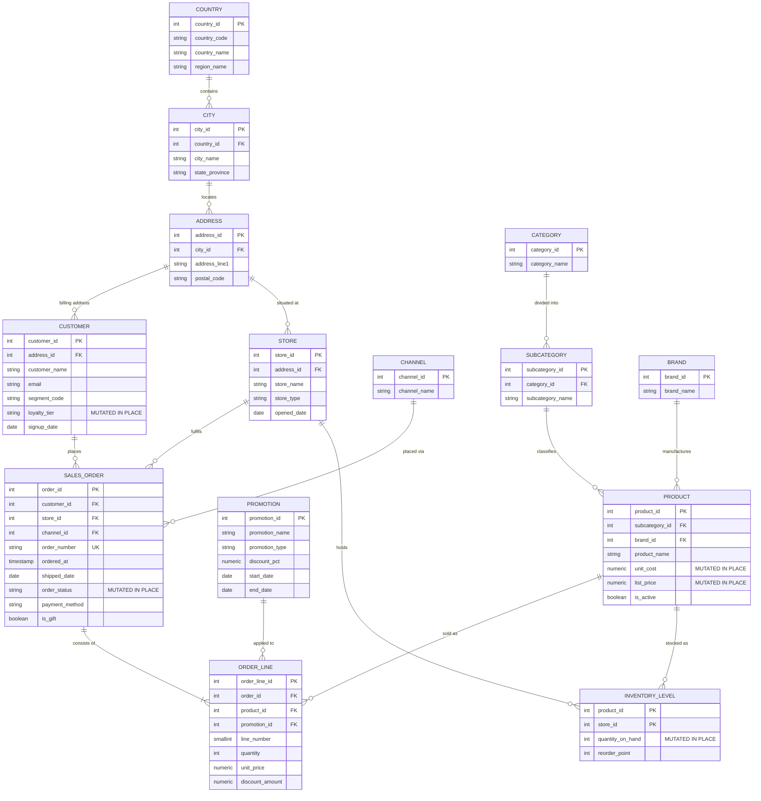

# Entity-Relationship Diagrams

This file shows the **two ER models** that bracket the pipeline:

1. **The source OLTP system** — normalized to 3NF, optimized for writing orders.
2. **The warehouse** — the same business reality, physically restructured for reading.

Seeing them side by side is the clearest possible illustration of what
dimensional modeling actually *does*. The star schema view of model 2 lives in
[`star_schema.md`](star_schema.md).

---

## 1. Source system (OLTP, 3NF)

This is the model the sales application writes to. We do **not** own it — we
extract from it. It is shown here because you cannot design a good warehouse
without understanding the shape of what you're reading.



### What to notice

**Fourteen tables to describe one sale.** Answering *"revenue by region by
month"* requires joining `ORDER_LINE → SALES_ORDER → CUSTOMER → ADDRESS → CITY →
COUNTRY`. Six joins, and that's before you touch the product hierarchy. This is
correct design for OLTP and painful design for analytics.

**Five columns marked `MUTATED IN PLACE`.** These are the ones that destroy
history:

| Column | What is lost on `UPDATE` |
|---|---|
| `CUSTOMER.loyalty_tier` | Which tier the customer held **when they bought** |
| `PRODUCT.unit_cost` | The cost basis that applied on the sale date → historical margin becomes unrecoverable |
| `PRODUCT.list_price` | The price ladder at time of sale |
| `SALES_ORDER.order_status` | Every prior state in the fulfilment lifecycle |
| `INVENTORY_LEVEL.quantity_on_hand` | Yesterday's stock position — there is **no** history table at all |

The OLTP system is not broken; it is doing exactly what it should. It answers
*"what is true now?"* efficiently. The warehouse's job is to answer *"what was
true then?"*, and that requires capturing these values before they're
overwritten — which is precisely what SCD Type 2 and the periodic snapshot fact
are for.

---

## 2. Warehouse (physical ER)

The same business reality, restructured. Note the **direction of the arrows**:
in the OLTP model, relationships fan out in every direction. Here, every
relationship points *from* the fact *to* a dimension. Nothing points dimension →
dimension. That is what makes it a star rather than a snowflake.

```mermaid
erDiagram
    DIM_DATE        ||--o{ FACT_SALES              : "order_date_key"
    DIM_DATE        ||--o{ FACT_SALES              : "ship_date_key"
    DIM_CUSTOMER    ||--o{ FACT_SALES              : "customer_key"
    DIM_PRODUCT     ||--o{ FACT_SALES              : "product_key"
    DIM_STORE       ||--o{ FACT_SALES              : "store_key"
    DIM_PROMOTION   ||--o{ FACT_SALES              : "promotion_key"
    DIM_CHANNEL     ||--o{ FACT_SALES              : "channel_key"
    DIM_ORDER_JUNK  ||--o{ FACT_SALES              : "order_junk_key"
    DIM_DATE        ||--o{ FACT_INVENTORY_SNAPSHOT : "snapshot_date_key"
    DIM_PRODUCT     ||--o{ FACT_INVENTORY_SNAPSHOT : "product_key"
    DIM_STORE       ||--o{ FACT_INVENTORY_SNAPSHOT : "store_key"

    DIM_DATE {
        int      date_key           PK "YYYYMMDD smart key"
        date     full_date          UK
        smallint year_number
        smallint quarter_number
        smallint month_number
        string   month_name
        smallint week_of_year
        string   day_name
        boolean  is_weekend
        boolean  is_holiday
        smallint fiscal_year
        int      prior_year_date_key
    }
    DIM_CUSTOMER {
        bigint  customer_key    PK "surrogate"
        string  customer_id     "natural key - NOT unique"
        string  customer_name
        string  customer_segment
        string  loyalty_tier    "SCD2 tracked"
        string  city
        string  state_province
        string  country
        string  region
        date    valid_from      "SCD2"
        date    valid_to        "SCD2"
        boolean is_current      "SCD2"
        int     version_number  "SCD2"
    }
    DIM_PRODUCT {
        bigint  product_key     PK "surrogate"
        string  product_id      "natural key - NOT unique"
        string  product_name
        string  category
        string  subcategory
        string  brand
        numeric unit_cost       "SCD2 tracked"
        numeric list_price      "SCD2 tracked"
        date    valid_from      "SCD2"
        date    valid_to        "SCD2"
        boolean is_current      "SCD2"
        int     version_number  "SCD2"
    }
    DIM_STORE {
        bigint  store_key       PK "surrogate"
        string  store_id        UK "natural key - unique - SCD1"
        string  store_name
        string  store_type
        string  city
        string  region
        int     square_feet
    }
    DIM_PROMOTION {
        bigint  promotion_key   PK
        string  promotion_id    UK
        string  promotion_name
        string  promotion_type
        numeric discount_pct
        date    start_date
        date    end_date
    }
    DIM_CHANNEL {
        bigint  channel_key     PK
        string  channel_id      UK
        string  channel_name
        string  channel_group
    }
    DIM_ORDER_JUNK {
        int     order_junk_key  PK "junk dimension"
        string  order_status
        string  payment_method
        string  shipping_priority
        boolean is_gift
    }
    FACT_SALES {
        bigint  sales_key         PK
        int     order_date_key    FK "PK part - partition key"
        int     ship_date_key     FK "role-playing"
        bigint  customer_key      FK
        bigint  product_key       FK
        bigint  store_key         FK
        bigint  promotion_key     FK
        bigint  channel_key       FK
        int     order_junk_key    FK
        string  order_number      "DEGENERATE DIMENSION"
        smallint order_line_number
        int     quantity          "additive"
        numeric unit_price        "non-additive rate"
        numeric unit_cost         "snapshotted at sale time"
        numeric discount_amount   "additive"
        numeric gross_sales_amount "GENERATED"
        numeric net_sales_amount   "GENERATED"
        numeric gross_profit_amount "GENERATED"
    }
    FACT_INVENTORY_SNAPSHOT {
        int     snapshot_date_key PK
        bigint  product_key       PK
        bigint  store_key         PK
        int     quantity_on_hand  "SEMI-ADDITIVE"
        int     quantity_on_order "SEMI-ADDITIVE"
        numeric inventory_value_amount "SEMI-ADDITIVE"
        boolean is_stockout
    }
```



### What to notice

**`DIM_DATE` connects to `FACT_SALES` twice.** One physical table serving two
business roles (order date, ship date) is a **role-playing dimension**. It is
disambiguated at query time by aliasing:

```sql
FROM warehouse.fact_sales f
JOIN warehouse.dim_date od ON od.date_key = f.order_date_key
JOIN warehouse.dim_date sd ON sd.date_key = f.ship_date_key
```

**`customer_id` and `product_id` are *not* unique.** That is not a modeling
error — it is SCD Type 2 working. One real customer with three historical
versions occupies three rows sharing one `customer_id`. What *is* enforced is a
partial unique index on `(customer_id) WHERE is_current` — at most one row per
customer may be the live one.

**`order_number` sits on the fact with no dimension table.** It has no
attributes worth storing — a `dim_order` would be a key column and nothing else.
It stays on the fact as a **degenerate dimension**, where it still does useful
work: grouping lines into baskets, and forming the idempotency key.

**The two facts share `DIM_PRODUCT`, `DIM_STORE` and `DIM_DATE`.** Because those
dimensions are *conformed*, a single query can ask whether stockouts in a store
preceded a sales decline in that same store. Without conformed dimensions, those
would be two datasets you can only compare in a spreadsheet.

**Fourteen source tables became nine.** And the six-join path from order line to
region became one join, because `dim_customer` carries `region` directly.

---

## 3. The transformation, side by side

| Concern | OLTP (source) | Warehouse (target) |
|---|---|---|
| Tables to describe a sale | 14 | 9 |
| Joins for "revenue by region" | 6 | 1 |
| Normal form | 3NF | Star (2NF dimensions, deliberately denormalized) |
| Redundancy | Minimized | **Accepted on purpose** — `country` repeats on every customer row |
| History | Overwritten | Preserved via SCD2 + daily snapshots |
| Primary keys | Natural / source | Surrogate integers |
| Optimized for | Fast, correct single-row writes | Fast large-range reads |
| `NULL` foreign keys | Common | **Impossible** — Unknown/N-A members instead |

The redundancy is the trade. We spend disk — the cheapest resource — to buy join
elimination and query simplicity, which cost analyst time and CPU. At warehouse
scale that is almost always the right side of the trade.

Reasoning in full: [`../docs/dimensional_modeling.md`](../docs/dimensional_modeling.md)
