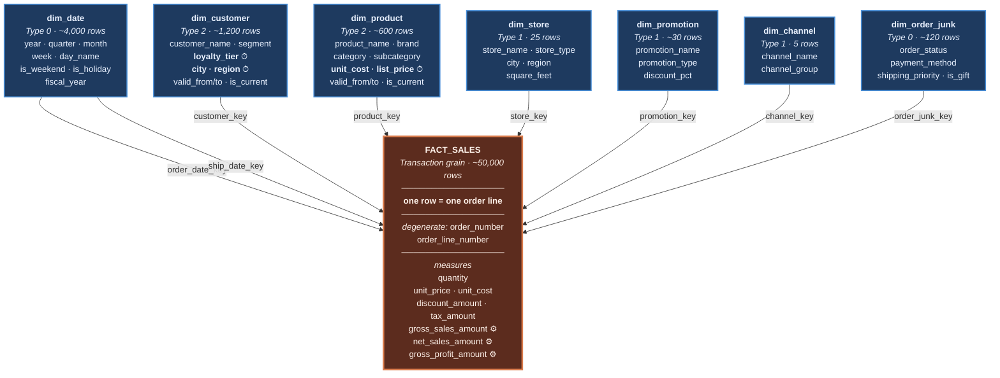
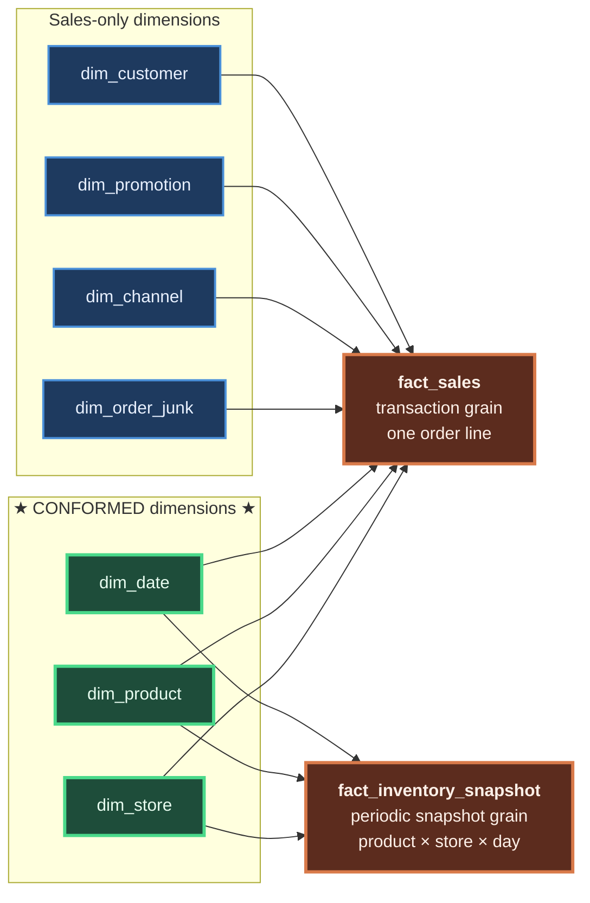
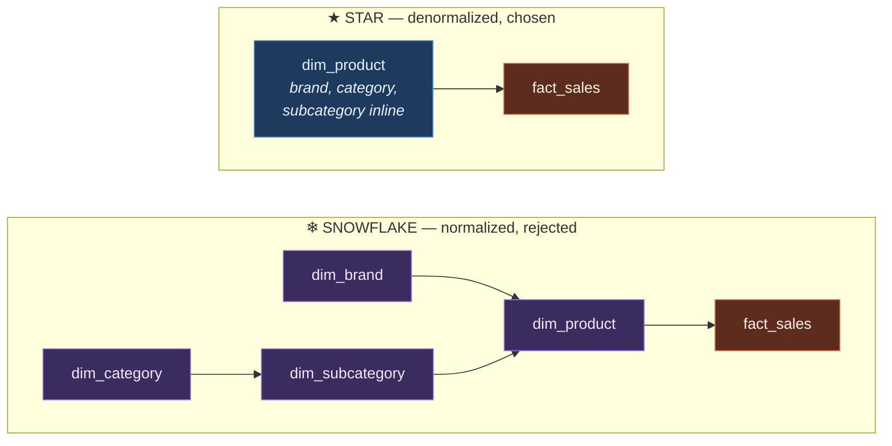
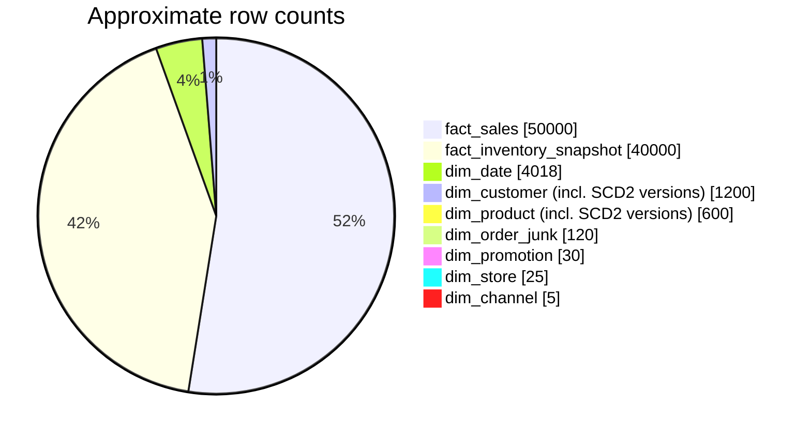
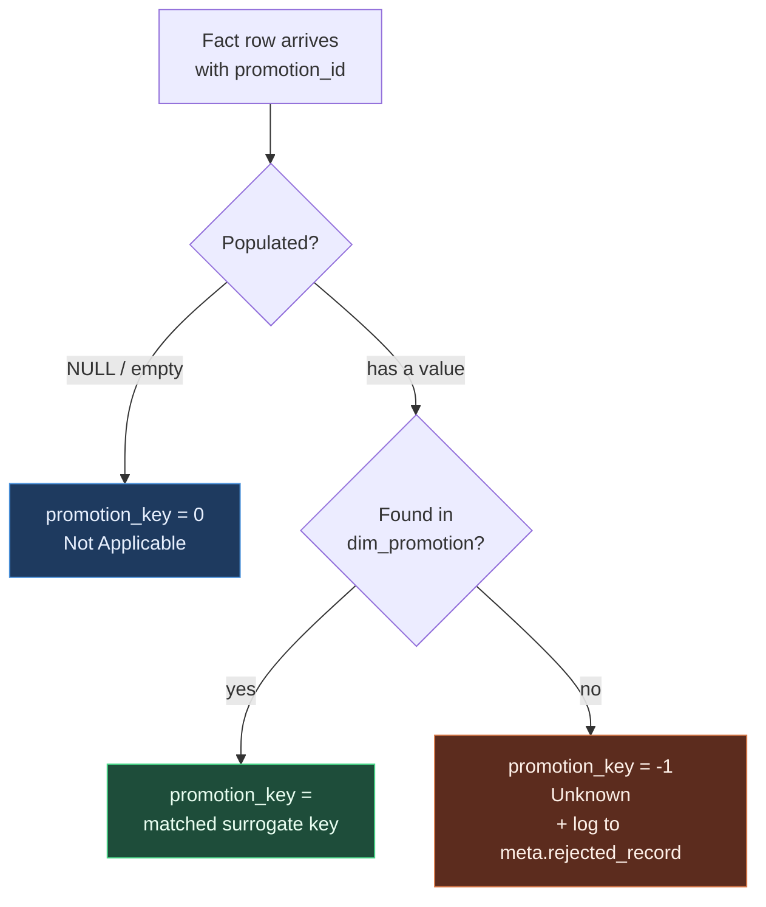

# Star Schema

Where [`er_diagram.md`](er_diagram.md) shows *physical* structure, this file
shows the **logical dimensional model** — the shape an analyst reasons in.

---

## 1. The core star: `fact_sales`



**Legend** — ⏱ SCD Type 2 tracked attribute · ⚙ generated (computed) column

Note `dim_date` drawn with **two** arrows into the fact. Same table, two roles.

---

## 2. The fact constellation

Two facts sharing conformed dimensions is a **fact constellation** (or *galaxy
schema*). The shared dimensions in the middle are what make cross-process
analysis possible.



### Why conformed dimensions are the whole point

Because both facts join to *the same* `dim_product` and `dim_store` rows, you
can drill across processes in one query — sales and inventory, aligned on the
same product and the same store:

```sql
-- Did stockouts precede the sales decline?
SELECT  p.category,
        d.year_month,
        SUM(s.net_sales_amount)                      AS net_sales,
        AVG(i.quantity_on_hand)                      AS avg_stock,   -- AVG: semi-additive
        SUM(i.is_stockout::int)                      AS stockout_days
FROM         warehouse.fact_sales              s
JOIN         warehouse.dim_product             p ON p.product_key = s.product_key
JOIN         warehouse.dim_date                d ON d.date_key    = s.order_date_key
LEFT JOIN    warehouse.fact_inventory_snapshot i
          ON i.product_key       = s.product_key
         AND i.store_key         = s.store_key
         AND i.snapshot_date_key = s.order_date_key
GROUP BY p.category, d.year_month;
```

Without conformed dimensions — if sales used `product_id` and inventory used
`sku_code`, each with its own category spelling — this query cannot be written
at all. You get two reports that disagree and an argument about which is right.
**That is the failure mode conformed dimensions exist to prevent.**

---

## 3. Star vs snowflake — and why this is a star

`dim_product` stores `category` and `subcategory` as plain text columns,
repeated on every row. A **snowflake** would normalize them into their own
tables.



| | Snowflake | **Star (chosen)** |
|---|---|---|
| Joins for "sales by category" | 3 | **1** |
| Storage | Slightly less | Slightly more |
| Update anomalies | Structurally prevented | Prevented by ETL instead |
| BI-tool friendliness | Poor — tools must be taught the chain | **Excellent** — flat and obvious |
| Query readability | Chain of joins | One join |

**Decision: star.** The redundancy that normalization exists to prevent is a
*write*-time hazard, and dimensions are only ever written by a controlled ETL
process — never by an application, never by a user. The anomaly can't occur, so
we're paying normalization's cost (joins on every single query, forever) to
insure against a risk that doesn't exist here.

Storage is the cheapest resource in the stack. Analyst time is the most
expensive. Star wins.

---

## 4. Grain — the first and most important decision

> **The grain is a business statement, made before you choose a single column.**

| Fact | Grain statement | Consequence |
|---|---|---|
| `fact_sales` | *One row per **line item** on a customer order* | A 3-item order produces 3 rows. Order-level values (shipping, order discount) must be **allocated** down to lines or kept out of the fact |
| `fact_inventory_snapshot` | *One row per **product, per store, at the close of each day*** | Rows exist even with zero movement — that's the point of a snapshot: `quantity_on_hand` is a **state**, not an event |

### Why line-item grain and not order grain?

Line-item is the **lowest** grain the source supports, and the rule is: *always
model at the lowest available grain.*

Aggregating to order level would make `fact_sales` ~5× smaller and permanently
destroy the ability to answer anything product-related — no category analysis,
no product margin, no basket affinity. You cannot recover detail you chose not
to store. Rolling *up* from fine grain is a `GROUP BY`; rolling *down* from
coarse grain is impossible.

---

## 5. Additivity — the trap in this schema

Additivity determines which aggregate functions are *legal* on a measure across
which dimensions. Getting this wrong produces numbers that look plausible and
are wrong, which is worse than an error.

| Measure | Type | `SUM` across… | Why |
|---|---|---|---|
| `quantity` | **Additive** | every dimension | Units sold genuinely add up |
| `net_sales_amount` | **Additive** | every dimension | Money from separate transactions adds |
| `gross_profit_amount` | **Additive** | every dimension | Difference of two additive measures |
| `unit_price` | **Non-additive** | *none* | A **rate**. `SUM(unit_price)` has no meaning. Use `SUM(net_sales_amount) / SUM(quantity)` |
| `discount_pct` | **Non-additive** | *none* | Percentages never sum; re-derive from components |
| `quantity_on_hand` | **Semi-additive** | product, store — **never date** | ⚠ See below |
| `inventory_value_amount` | **Semi-additive** | product, store — **never date** | Same reason |

### The semi-additive trap, concretely

Store S1 holds 100 units of product P on Monday. Nothing moves Tuesday or
Wednesday.

```
Mon  quantity_on_hand = 100
Tue  quantity_on_hand = 100
Wed  quantity_on_hand = 100
```

```sql
SELECT SUM(quantity_on_hand) FROM fact_inventory_snapshot
WHERE product_key = P AND store_key = S1
  AND snapshot_date_key BETWEEN 20240101 AND 20240103;
-- → 300  ✗ WRONG. There were never 300 units.
```

The same 100 physical units were counted three times. Correct answers depend on
the question:

```sql
-- Average stock position over the period
SELECT AVG(quantity_on_hand) ...;                      -- → 100  ✓

-- Closing balance (the standard finance convention)
SELECT quantity_on_hand ... ORDER BY snapshot_date_key DESC LIMIT 1;  -- → 100  ✓

-- Total across products/stores on ONE day — SUM is fine here
SELECT SUM(quantity_on_hand) ... WHERE snapshot_date_key = 20240103;  -- ✓
```

`SUM` is not wrong in general — it is wrong **across the date dimension
specifically**. That is exactly what "semi-additive" means, and it's the most
common source of silently incorrect warehouse reporting.

---

## 6. Dimension sizing

Dimensions are small; facts are large. Almost all storage and all query cost
lives in the fact tables — which is why dimension denormalization is nearly free
and fact-row width is worth guarding.



**~90,000 fact rows vs ~6,000 dimension rows.** Adding a text column to
`dim_product` costs ~600 rows' worth of storage. Adding one to `fact_sales`
costs 50,000. Hence: **denormalize dimensions freely, keep facts narrow.**

---

## 7. Reserved dimension members

Every dimension is seeded with two rows before any real data lands.

| Key | Member | Meaning | Example |
|---:|---|---|---|
| `-1` | **Unknown** | A value was expected but couldn't be resolved | A sale references a product missing from the master feed |
| `0` | **Not Applicable** | No value is expected — legitimately absent | An order placed with no promotion |



This yields three properties worth stating in an interview:

1. **No revenue is ever silently dropped.** A row with an unresolvable product
   still contributes its money to the totals.
2. **Every FK stays `NOT NULL`; every join stays an `INNER JOIN`.** No
   `LEFT JOIN` defensiveness, no `COALESCE` scattered through the codebase, no
   `NULL`-related `COUNT` surprises.
3. **Data quality becomes measurable.** `WHERE product_key = -1` is a direct
   count of the feed's failure rate — a metric you can put an SLA on.

---

## 8. Reading the star: the canonical query shape

Nearly every analytical query against this model has the same skeleton, which is
the practical payoff of the design:

```sql
SELECT      <dimension attributes>,          -- what you're slicing BY
            <aggregate(measures)>            -- what you're measuring
FROM        warehouse.fact_sales    f        -- exactly ONE fact table
JOIN        warehouse.dim_date      d  ON d.date_key     = f.order_date_key
JOIN        warehouse.dim_product   p  ON p.product_key  = f.product_key
JOIN        warehouse.dim_customer  c  ON c.customer_key = f.customer_key
WHERE       <dimension filters>              -- filter on DIMENSIONS, not the fact
GROUP BY    <dimension attributes>
ORDER BY    <aggregate or attribute>;
```

One fact, N dimensions, all joins one hop, every join on an indexed integer key.
No join chains, no subquery gymnastics, no ambiguity about which table a
business attribute lives in.

That predictability is why BI tools can generate SQL against a star automatically
and why a new analyst is productive on day one — and it's the whole return on
the modeling work.
