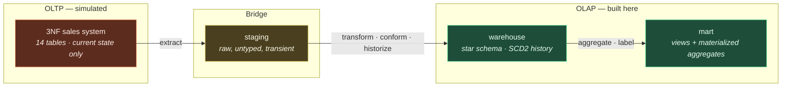

# OLTP vs OLAP

> *"Why can't we just run the reports against the production database?"*

You can. It works until it doesn't, and then it fails in two directions at once:
the reports get slow, and the checkout page gets slow with them. This document
explains why those two workloads are genuinely incompatible, and what each one
optimizes for.

---

## 1. The two workloads

| | **OLTP** — Online *Transaction* Processing | **OLAP** — Online *Analytical* Processing |
|---|---|---|
| Purpose | Run the business | Understand the business |
| Typical user | Customer, cashier, application | Analyst, executive, data scientist |
| Unit of work | *"Place this order"* | *"Margin by subcategory by region, YoY"* |
| Rows touched per query | 1 – 100 | 100,000 – 1,000,000,000 |
| Columns touched per query | Most of a narrow row | **3–8 of a wide row** |
| Read : write ratio | ~50 : 50 | ~99.9 : 0.1 |
| Query pattern | Known in advance, parameterized | **Ad-hoc, unpredictable** |
| Latency target | < 50 ms | seconds to minutes |
| Concurrency | Thousands of sessions | Tens |
| Data currency | Real-time, to the millisecond | Yesterday's close is usually fine |
| History | Current state only | **Full history, deliberately** |
| Schema | Normalized (3NF/BCNF) | Denormalized (star) |
| Typical size | GB | TB – PB |
| Data source | Direct user input | Batched from many OLTP systems |
| Failure impact | **Business stops** | A dashboard is stale |

That last row drives everything. An OLTP outage costs revenue per minute. This
is the fundamental reason for physical separation: **an analyst's runaway query
must not be able to take down checkout.**

---

## 2. Why 3NF is right for OLTP

Third normal form eliminates redundancy so every fact is stored exactly once.
Its payoff is *write* integrity.

```sql
-- OLTP: a customer moves house
UPDATE address SET city = 'Austin', postal_code = '78701'
WHERE address_id = 88123;
-- ONE row changed. Correct everywhere, instantly, atomically.
```

Because `city` exists in exactly one place, it is impossible for the database to
hold two contradictory answers to *"where does this customer live?"* That class
of bug — the **update anomaly** — is structurally eliminated.

The cost is paid on reads. Data spread across many narrow tables must be
reassembled by joins.

---

## 3. Why 3NF is wrong for OLAP

The same query in each model:

```sql
-- ══ OLTP (3NF): revenue by region, last quarter ══
SELECT  co.region_name,
        SUM(ol.quantity * ol.unit_price - ol.discount_amount) AS revenue
FROM order_line   ol
JOIN sales_order  so ON so.order_id    = ol.order_id
JOIN customer     c  ON c.customer_id  = so.customer_id
JOIN address      a  ON a.address_id   = c.address_id
JOIN city         ci ON ci.city_id     = a.city_id
JOIN country      co ON co.country_id  = ci.country_id
WHERE so.ordered_at >= '2024-01-01' AND so.ordered_at < '2024-04-01'
GROUP BY co.region_name;
-- 6 joins. And this is one of the SIMPLER analytical questions.
```

```sql
-- ══ OLAP (star): the same question ══
SELECT  c.region,
        SUM(f.net_sales_amount) AS revenue
FROM warehouse.fact_sales   f
JOIN warehouse.dim_customer c ON c.customer_key = f.customer_key
JOIN warehouse.dim_date     d ON d.date_key     = f.order_date_key
WHERE d.year_number = 2024 AND d.quarter_number = 1
GROUP BY c.region;
-- 1 join to reach region. Both joins are one hop from the fact.
```

The star wins on four separate axes:

1. **Join count.** 6 → 1. Each join is a chance for the planner to pick a bad
   order; the search space grows factorially with join count.
2. **Cognitive load.** The analyst needs to know one table (`dim_customer`)
   holds all customer attributes, not memorize a six-table traversal.
3. **Predictability.** Star queries all look the same, so plans are stable. A
   6-join query can flip to a catastrophically bad plan on a statistics change.
4. **Correctness.** `SUM(quantity * unit_price - discount)` is retyped by every
   analyst, slightly differently. `net_sales_amount` is defined once in DDL.

### And the part SQL can't fix

Even with unlimited joins, the OLTP model **cannot answer certain questions at
all**:

```sql
-- "Revenue from customers who were Gold tier AT THE TIME OF PURCHASE"
```

`customer.loyalty_tier` holds today's tier. Whatever it was last March was
overwritten. The information is gone — not slow to retrieve, *gone*. Same for
historical cost (so historical margin is unrecoverable) and yesterday's stock
level (no history table exists).

**This is the deepest reason warehouses exist.** It is not primarily about
speed. It is that OLTP systems are designed to answer *"what is true now?"* and
analytics needs *"what was true then?"* — and only a system that deliberately
captures change can answer the second.

---

## 4. Row storage vs column storage

Not part of this PostgreSQL project directly, but the reason Snowflake/BigQuery/
Redshift exist — and a very common follow-up question.

```
ROW STORE (PostgreSQL) — a row's columns are contiguous on disk
┌──────────────────────────┬──────────────────────────┬─────────────
│ 1│Widget│Tools│19.99│…   │ 2│Gadget│Home │24.50│…   │ 3│…
└──────────────────────────┴──────────────────────────┴─────────────
  ▲ Read one whole row: ONE page fetch. Perfect for OLTP.
  ▼ SUM(price) over 50M rows: must read every column of every row.

COLUMN STORE (Redshift / BigQuery / Parquet) — a column is contiguous
┌────────────┬───────────────────┬──────────────────┬────────────────
│ 1│2│3│…    │ Widget│Gadget│…   │ Tools│Home│…     │19.99│24.50│…
└────────────┴───────────────────┴──────────────────┴────────────────
  ▲ SUM(price): read ONLY the price column. ~10× less I/O on a 40-col table.
  ▲ Neighbouring values share a type and domain → 5–20× compression.
  ▲ Runs vectorized (SIMD) over tightly packed arrays.
  ▼ Insert one row: touch every column segment. Terrible for OLTP.
```

The two rows of that diagram are the whole argument. Analytical queries read
**few columns of many rows**; transactional queries read **many columns of few
rows**. The optimal physical layout is exactly opposite.

**Where PostgreSQL sits:** it is a row store, so it is not the theoretically
ideal analytical engine. At this project's scale it is entirely the right
choice — its planner, window functions, CTEs and partitioning are excellent, and
columnar's advantages only dominate past hundreds of millions of rows. The
`citus`/`columnar` extension can add columnar storage if needed. Knowing *where*
that crossover lies is more valuable than reflexively reaching for a big-data
tool.

---

## 5. Indexing: opposite strategies

| | OLTP | OLAP |
|---|---|---|
| Goal | Find **one row** fast | Scan a **range** efficiently |
| Typical index | B-tree on selective columns | B-tree on FK/date + covering indexes |
| Index count | Many (10–20 per table) | **Few** — indexes slow bulk loads |
| Write penalty | Accepted, writes are small | **Critical** — every index is rebuilt per load |
| Best friend | High selectivity (unique-ish) | **Partitioning** + `BRIN` + clustering |
| Full table scan | An emergency | Often the **optimal** plan |

The last row surprises people. A query aggregating 60 % of a fact table should
*not* use an index — random I/O for 60 % of pages is far slower than one
sequential scan. `EXPLAIN` showing `Seq Scan` on a big aggregation is usually
the planner being right.

This is why [`indexes.sql`](../indexes.sql) runs **after**
[`sample_data.sql`](../sample_data.sql): building a B-tree once over a finished
table beats maintaining it across 50,000 inserts.

---

## 6. Normalization vs denormalization, honestly

Denormalization is not "the same thing but faster". It is a **deliberate trade**:

| You give up | You gain |
|---|---|
| Storage efficiency | Join elimination |
| Structural protection from update anomalies | Query simplicity |
| Single-place updates | Predictable, stable query plans |
| | Point-in-time historical accuracy (via SCD) |

The trade only works because of one fact specific to warehouses:

> **Dimension tables are written by exactly one controlled ETL process, never by
> an application and never by a user.**

Update anomalies are a *concurrent uncontrolled write* problem. In a warehouse
there are no concurrent uncontrolled writes. The risk normalization insures
against does not exist here — so paying its premium (a join on every query,
forever) is a bad deal.

Denormalize a **transactional** database and you get corruption. Denormalize a
**warehouse dimension** and you get speed. Same technique, opposite outcome,
because the surrounding constraints differ. Being able to articulate *why*
they differ is the point.

---

## 7. ACID and concurrency

| | OLTP | OLAP |
|---|---|---|
| Transaction scope | A few rows, milliseconds | Millions of rows, minutes |
| Isolation concern | Lost updates, phantom reads, deadlocks | **Read consistency across a long query** |
| Locking | Row-level, brief, high contention | Table-level during load; readers use MVCC |
| Rollback risk | High — user cancels, payment declines | Low — batch either completes or is re-run |
| Durability need | Absolute, per commit | Per batch |

Warehouses still want ACID, but for a different reason: a load must be **all or
nothing**, so a report never sees half of last night's file. That's why
`etl_simulation.sql` wraps each phase in an explicit transaction — a failure
mid-load leaves *no* partial data, and the fix is simply to re-run.

---

## 8. Why a separate system, not just a replica

A read replica solves *one* of the four problems.

| Problem | Read replica | **Warehouse** |
|---|---|---|
| Analyst queries slow down checkout | ✅ solved | ✅ solved |
| 6-join queries are hard to write | ❌ same schema | ✅ star schema |
| History is overwritten | ❌ replicates the overwrite | ✅ SCD2 preserves it |
| Data from CRM + ERP + web logs | ❌ one system only | ✅ integrated + conformed |

A replica gives you isolation. A warehouse gives you isolation **plus**
integration, history and a model built for the questions. Only the last three
are the actual work.

---

## 9. Where this project sits



The source ER model is in [`../diagrams/er_diagram.md`](../diagrams/er_diagram.md);
the target star is in [`../diagrams/star_schema.md`](../diagrams/star_schema.md).
Comparing them is the shortest path to understanding this whole document.

---

## 10. Quick answers for interviews

**"What's the difference between OLTP and OLAP?"**
> OLTP runs the business — many small, concurrent, write-heavy transactions
> against a normalized schema, optimized for sub-50 ms single-row operations.
> OLAP understands the business — few large, read-heavy, ad-hoc aggregations
> against a denormalized schema, optimized for scanning millions of rows. They
> have opposite optimal designs, so they get separate systems.

**"Why not just report off production?"**
> Three reasons. Resource contention — an analyst's query shouldn't be able to
> slow checkout. Schema — analytical questions need 6+ joins against 3NF.
> And history — production overwrites `loyalty_tier` and `unit_cost`, so
> point-in-time questions are unanswerable there at any speed.

**"Why denormalize if normalization prevents anomalies?"**
> Update anomalies are a concurrent-uncontrolled-write problem. Warehouse
> dimensions are written only by a single controlled ETL process, so that risk
> doesn't exist — which makes normalization's premium (a join on every query)
> a bad trade. Same technique, different constraints, opposite conclusion.

**"When is a star schema the wrong choice?"**
> When the workload is transactional; when the model is genuinely graph-shaped
> (fraud rings, social networks); when requirements are so volatile that a
> schema-on-read lake is more honest; or when the data is small enough that a
> single well-indexed table answers everything and a warehouse is just overhead.

**"Row store or column store?"**
> Column store for analytics — you read few columns of many rows, so columnar
> cuts I/O ~10× and compresses 5–20× because neighbouring values share a domain.
> Row store for OLTP, where you need every column of one row in a single fetch.
> PostgreSQL is a row store, which is fine below roughly 100 M rows; past that
> the columnar advantage starts to dominate.
